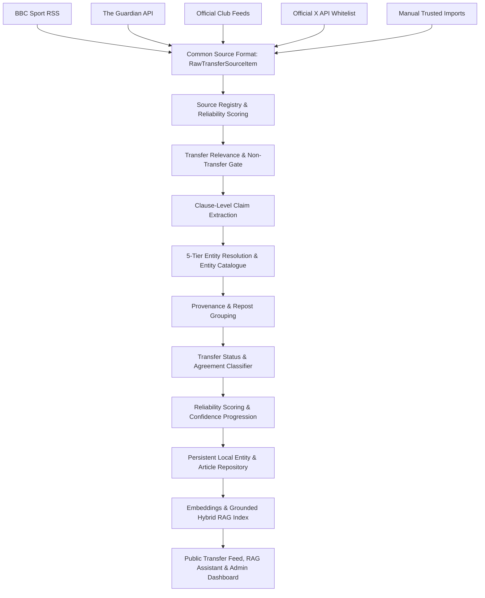

# Football Transfer Intelligence Platform ⚽🤖

An AI-powered football transfer intelligence platform built with **Next.js 15 App Router**, **React 19**, **TypeScript**, **Tailwind CSS**, **Python FastAPI ML**, **Grounded Hybrid RAG**, **Dynamic Football Entity Catalogue**, and **Multi-Source Ingestion Orchestration**.

The platform aggregates verified transfer reports from trusted newspapers, official club press releases, and insider social posts, filtering out unverified clickbait and categorizing rumours by transfer stage, entity confidence, and source reliability.

---

## 🎯 Architecture Diagram



---

## 🚀 Key Technical Features

1. **Multi-Source Ingestion Engine (`src/lib/news/providers/`):**
   - Unified `TransferSourceAdapter` abstraction connecting BBC RSS, The Guardian API, Official Club RSS feeds, official X API v2 adapter, and manual imports.
   - Circuit-breaker fault isolation using `Promise.allSettled` ensures single-source outages do not crash the feed.

2. **Dynamic Football Entity Catalogue (`src/lib/entities/`):**
   - Local cached entity repository (`.data/football-entities.json`) maintaining canonical definitions for 38 clubs across 8 supported leagues (Premier League, La Liga, Serie A, Bundesliga, Ligue 1, Süper Lig, Saudi Pro League, Primeira Liga).
   - Sync engine (`syncSupportedLeagues`, `syncLeagueTeams`, `syncTeamSquad`) backed by `FootballDataProvider` (football-data.org API driver) and `MockFootballEntityProvider` for offline snapshots.

3. **5-Tier Entity Resolution Fallback Priority (`src/lib/news/resolve-transfer-entities.ts`):**
   - Resolves transfer subjects with a strict 5-tier fallback hierarchy:
     $$\text{Explicit Verified Article Evidence} \xrightarrow{\quad} \text{Entity Catalogue} \xrightarrow{\quad} \text{Reviewed Aliases} \xrightarrow{\quad} \text{Legacy Fallback} \xrightarrow{\quad} \text{Unknown}$$
   - Prevents generic terms like "United" or "City" from falsely triggering club mappings unless surrounding clause context permits.

4. **Clause-Level Sentence Parsing (`extractTransferClaims`):**
   - Isolates individual sentences and clauses in multi-rumour roundup articles to eliminate cross-contamination of player origin and destination clubs.

5. **Grounded Hybrid RAG Assistant (`src/lib/rag/`):**
   - Composite weighting retrieval: **40% Semantic Similarity + 25% Keyword Match + 20% Source Reliability + 15% Recency**.
   - Context sanitization to prevent prompt injection and Zod output schema validation (`GroundedTransferAnswer`).

6. **Machine Learning Status Classifier (`ml-service/`):**
   - Python FastAPI microservice utilizing scikit-learn Linear SVM & Logistic Regression with TF-IDF N-gram feature extraction.

7. **Authentic Club Identity System (`src/components/clubs/club-logo.tsx`):**
   - Native vector SVG and high-resolution PNG crest assets for 38 top clubs, ensuring fallback crest rendering without hotlinking layout shifts.

8. **Deduplicated Notification Engine (`src/lib/notifications/`):**
   - Generates notifications strictly after verified story updates. Hashes `storyGroupId + eventType` to avoid redundant alerts. In-app bell counter, popover drawer, and dedicated notifications page.

---

## 🛠️ Technology Stack

- **Frontend & App Framework:** Next.js 15 App Router, React 19, TypeScript, Tailwind CSS, Lucide Icons.
- **Backend & Storage Layer:** Next.js Server API Routes, Persistent JSON & In-Memory Storage, Entity Repository.
- **Machine Learning & RAG:** Python 3.11, FastAPI, scikit-learn (Linear SVM, Logistic Regression), TF-IDF, OpenAI (`gpt-4o-mini`, `text-embedding-3-small`).
- **Testing & Quality Assurance:** Vitest (145 passing unit tests across 17 test suites), ESLint 9, TypeScript strict mode.

---

## 💻 Local Development Setup

### 1. Clone the repository
```bash
git clone https://github.com/your-username/footballTransferTracker.git
cd footballTransferTracker
```

### 2. Install dependencies
```bash
npm install
```

### 3. Environment configuration
Copy `.env.example` to `.env.local`:
```env
NEWS_PROVIDERS=bbc-rss,guardian,official-club,manual
GUARDIAN_API_KEY=
LLM_PROVIDER=openai
OPENAI_API_KEY=
EMBEDDING_PROVIDER=mock
FOOTBALL_ENTITY_PROVIDER=mock
FOOTBALL_DATA_API_KEY=
```

### 4. Run the development server
```bash
npm run dev
```
Open [http://localhost:3000](http://localhost:3000) in your browser.

### 5. Run test suite & type checking
```bash
npm test
npx tsc --noEmit
npm run lint
npm run build
```

---

## 🛡️ License & Trademarks

All club logos and crest assets in `public/clubs/` are used strictly for non-commercial identification and informational purposes within this project. All news headlines and article snippets are attributed to their original published sources.
