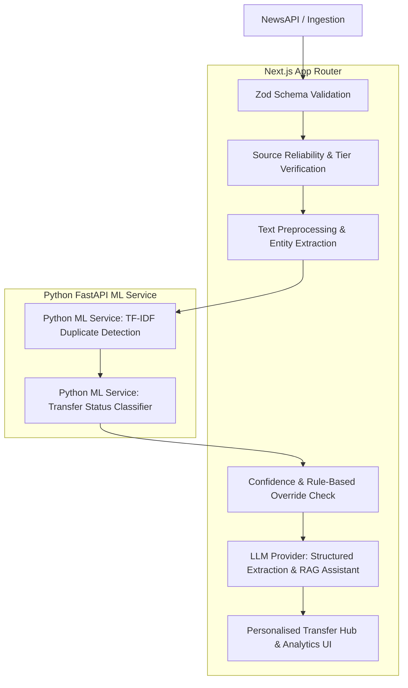

# PitchPulse — AI-Powered Transfer Intelligence Platform

PitchPulse is a production-grade, AI-powered football transfer intelligence application built with **Next.js 15 (App Router), TypeScript, Tailwind CSS**, and a **Python FastAPI Machine Learning Microservice**.

The platform filters out noise, social media clickbait, unverified rumor mills, and duplicate reports by combining deterministic source-verification rules with supervised machine learning (TF-IDF + Logistic Regression / Linear SVM), Retrieval-Augmented Generation (RAG), and Explainable AI.

---

## 🏛️ System Architecture



---

## 🧠 AI Processing Pipeline

1. **NewsAPI Ingestion:** Raw articles fetched server-side using secure environment variables.
2. **Article Validation:** Validated using strict Zod schemas (`title`, `description`, `url`, `author`).
3. **Trusted-Source Filtering:** Deterministic verification matching domains & journalists against approved tiers.
4. **Text Preprocessing:** Lowercase normalization, URL removal, punctuation cleaning while preserving proper nouns (players & clubs).
5. **Entity Extraction:** Identification of player names, current/destination clubs, and transfer keywords.
6. **TF-IDF Duplicate Detection:** Cosine similarity comparison (`>= 0.82` duplicate, `0.68 - 0.82` related) with 24-hour time-window and player/club entity matching.
7. **ML Transfer-Status Classification:** Supervised 9-class text classification (`OFFICIAL`, `AGREEMENT_REACHED`, `ADVANCED_TALKS`, `NEGOTIATIONS`, `BID_SUBMITTED`, `APPROACH_MADE`, `INTEREST`, `DEPARTURE_EXPECTED`, `NOT_TRANSFER_NEWS`).
8. **Reliability Scoring:** Transparent formula: Source (40%), Journalist (30%), Cross-confirmation (20%), Recency (10%).
9. **LLM Summary & RAG Assistant:** Low-temperature structured JSON extraction and grounded Q&A over verified reports.
10. **Human Review Queue:** Articles with confidence `< 0.65` or missing attributes are flagged for human review at `/admin/review`.

---

## 🤖 Why Each AI Technique Was Selected

* **TF-IDF Vectorization:** Captures domain-specific transfer n-grams (e.g. *"submitted opening bid"*, *"personal terms agreed"*) with minimal computational overhead.
* **Logistic Regression vs. Linear SVM:** Supervised classifiers trained on TF-IDF features with balanced class weights to handle sparse multi-class transfer news. Evaluated using **Macro F1-score**.
* **Cosine Similarity:** Provides deterministic, scale-invariant similarity scores between article term vectors.
* **Retrieval-Augmented Generation (RAG):** Restricts LLM responses strictly to stored, retrieved evidence, eliminating hallucinated transfer claims.
* **Deterministic Rule Overrides:** Hard-coded security rules ensure official club statements always take precedence over ML predictions.

---

## 🔒 Security Configuration

1. **`NEWS_API_KEY` Protection:** Stored in `.env.local` and accessed strictly in server-side Route Handlers.
2. **Git Hygiene:** `.gitignore` excludes `.env.local`, `.next/`, `node_modules/`, `ml-service/venv/`, and `ml-service/models/*.joblib`.
3. **Environment Documentation:** `.env.example` provides template variables without exposing production secrets.
4. **Key Rotation Notice:** Any API key previously committed in un-ignored environments should be regenerated immediately.

---

## 🚀 Getting Started & Local Setup

### Prerequisites

- Node.js 18+ and npm / yarn
- Python 3.9+ (optional for running Python FastAPI service natively)

### 1. Environment Setup

Copy `.env.example` to `.env.local`:

```bash
cp .env.example .env.local
```

Fill in your `NEWS_API_KEY`.

### 2. Running Next.js Application

```bash
npm install
npm run dev
```

Open `http://localhost:3000` to view the application.

### 3. Running Python ML Service (`ml-service/`)

```bash
cd ml-service
python -m venv venv
source venv/bin/activate  # On Windows: venv\Scripts\activate
pip install -r requirements.txt
python training/train_transfer_classifier.py
uvicorn app.main:app --reload --port 8000
```

---

## 🧪 Testing

### Running Next.js Vitest Suite

```bash
npm test
```

### Running TypeScript Check

```bash
npx tsc --noEmit
```

### Running Python Pytest Suite

```bash
cd ml-service
pytest tests/
```

---

## 📊 Application Routes

- **`/dashboard`**: Personalised transfer hub with club switcher, filters, and RAG Assistant.
- **`/sources`**: Public Source Reliability Directory with transparent scoring formula.
- **`/analytics`**: Real-time AI telemetry, status distribution charts, and ML confidence spread.
- **`/admin/labelling`**: Protected dataset labelling workbench with keyboard shortcuts & CSV export.
- **`/admin/review`**: Human-in-the-loop review queue for low-confidence predictions and duplicate merging.