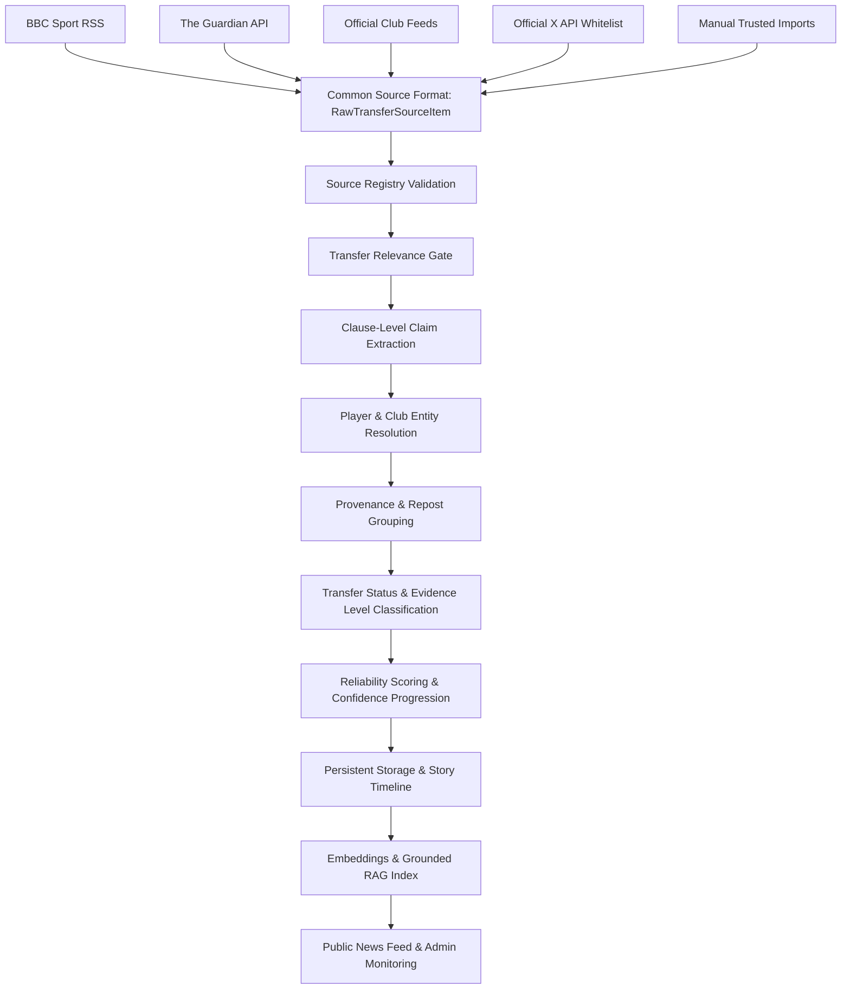

# Football Transfer Intelligence Platform ⚽🤖

A full-stack, real-time **AI-Powered Football Transfer Intelligence Platform** built with **Next.js 15 App Router**, **TypeScript**, **Python FastAPI ML**, **PostgreSQL / pgvector**, **Grounded Hybrid RAG**, and **Multi-Source Ingestion Orchestration**.

The platform aggregates verified transfer reports from trusted newspapers, official club press releases, and insider social posts, filtering out unverified clickbait and categorizing rumours by transfer stage and reliability.

---

## 🎯 Architecture Diagram



---

## 🚀 Key Technical Features

1. **Multi-Source Ingestion Engine (`src/lib/news/providers/`):**
   - Clean `TransferSourceAdapter` abstraction unifying BBC RSS, The Guardian API, Official Club RSS feeds, official X API v2 search adapter, and manual imports.
   - Circuit-breaker fault isolation using `Promise.allSettled` ensures single-source outages do not break the feed.

2. **Domain & Author Verification Registry (`src/config/source-registry.ts`):**
   - Registry mapping Tier 1 publishers (BBC, Guardian, Sky Sports), approved journalists (Fabrizio Romano, David Ornstein, Gianluca Di Marzio, Florian Plettenberg), and official club feeds with base reliability scores.

3. **Sentence-Level Clause Isolation (`src/lib/news/resolve-transfer-entities.ts`):**
   - Clause-boundary text parsing (`extractTransferClaims`) prevents cross-sentence entity contamination in multi-rumor roundup articles.

4. **Grounded Hybrid RAG Pipeline (`src/lib/rag/`):**
   - Reranking engine combining **40% Semantic Similarity + 25% Keyword Match + 20% Source Reliability + 15% Recency**.
   - Persistent article storage (`StoredTransferArticle`) with SHA-256 content hashing to avoid duplicate embedding calls. Strict prompt injection protection and Zod output validation (`GroundedTransferAnswer`).

5. **Early Signal & Provenance System (`src/lib/news/confidence-progression.ts`):**
   - Classifies reports into `official_confirmation`, `trusted_report`, `early_signal`, and `secondary_confirmation`.
   - Tracks reposts/quote posts so repeated insider posts do not count as false independent confirmations.

6. **Machine Learning Microservice (`ml-service/`):**
   - Python FastAPI microservice using TF-IDF n-gram vectorization (`ngram_range=(1,2)`) and Logistic Regression / Linear SVM classifiers trained on transfer headline patterns.

7. **Modern Minimal UI Layout:**
   - 4 top-level items (`Home`, `Leagues`, `Following`, `More`), permanent dark mode, responsive mobile navigation, clean Trending Targets widget, and contextual entity highlight strips.

8. **Admin Route Security Middleware (`src/middleware.ts`):**
   - Protects `/admin/*` pages and `/api/admin/*` endpoints with session/passcode checks (`ADMIN_SECRET`).

---

## 🛠️ Technology Stack

- **Frontend & App Framework:** Next.js 15 App Router, React 19, TypeScript, Tailwind CSS, Lucide Icons.
- **Backend & Vector Database:** PostgreSQL, `pgvector`, Next.js Server Handlers, In-Memory Repository.
- **Machine Learning & RAG:** OpenAI (`gpt-4o-mini`, `text-embedding-3-small`), Python 3.11, FastAPI, scikit-learn, TF-IDF, Linear SVM.
- **Testing:** Vitest (93 passing unit tests across 13 test suites).

---

## 💻 Local Development Setup

### 1. Clone the repository
```bash
git clone https://github.com/your-username/footballTransferTracker.git
cd footballTransferTracker
```

### 2. Install dependencies
```bash
npm install
```

### 3. Configure environment variables
Copy `.env.example` to `.env.local`:
```env
NEWS_PROVIDERS=bbc-rss,guardian,official-club,manual
GUARDIAN_API_KEY=
LLM_PROVIDER=openai
OPENAI_API_KEY=
EMBEDDING_PROVIDER=mock
ADMIN_SECRET=transfer-admin-secret-2026
```

### 4. Run automated test suite
```bash
npm test
```

### 5. Start development server
```bash
npm run dev
```
Open [http://localhost:3000](http://localhost:3000) in your browser.

---

## 🛡️ License

This project is licensed under the MIT License.