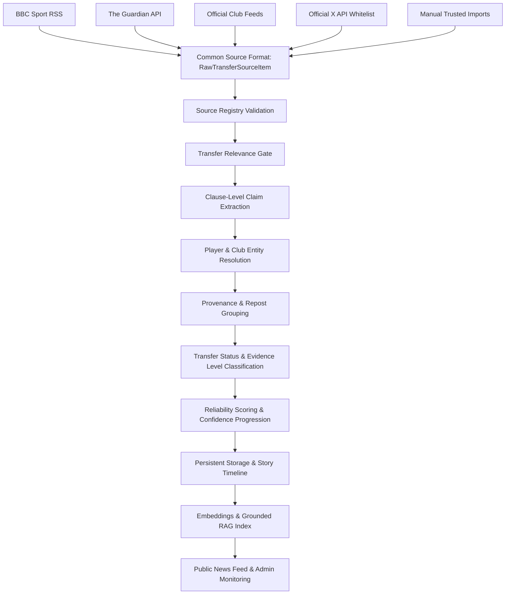
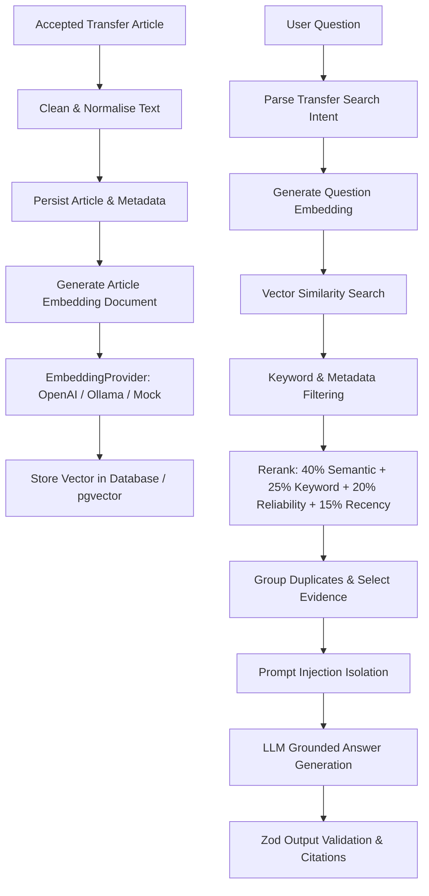

# 📝 Medium Article Outline & Draft Guide
> **Title Idea 1:** *How I Built an AI-Powered Football Transfer Intelligence Platform with Next.js 15, Python ML, and Grounded RAG*  
> **Title Idea 2:** *From Naive Web Scraping to a Production AI Architecture: The Evolution of a Football Transfer Tracker*  
> **Subtitle:** *An authentic technical breakdown of trial-and-error, architectural pivot points, TF-IDF machine learning, and zero-hallucination RAG.*

## 🧠 Core AI Concepts Simplified

- **TF-IDF** = convert meaning into numbers
- **Vector Database** = store and search those numbers
- **RAG** = retrieve useful information before answering
- **Structured Output** = force the answer into a reliable format
- **Agentic Workflow** = let the AI choose which approved tools and steps to use

---

## 📌 1. Introduction: The Noise Problem & The Vision

- **The Problem:** Football transfer windows are filled with clickbait headlines, unverified Twitter tier lists, and duplicate rumors copied across low-quality aggregator blogs.
- **The Vision:** Build a real-time, verified transfer intelligence platform where fans can follow their favorite clubs, inspect model confidence scores, and chat with an AI assistant grounded strictly in verified sports journalism.
- **Human Narrative Angle:** Share why traditional RSS aggregators fail and how building a custom hybrid architecture solved real-world data quality and latency issues.

---

## 🔄 2. The Architectural Evolutions: What We Tried First vs. What Worked

Structure each technical section around **"The Initial Approach" ➔ "Why It Failed" ➔ "The Refined Solution"**:

### Evolution 1: News Ingestion & Error Resilience
* **Initial Approach:** Fetching from a single news API endpoint sequentially.
* **Why It Failed:** Whenever an external API rate-limited or timed out, the entire homepage crashed or hung for 10+ seconds.
* **Refined Approach:** Built a multi-provider orchestrator (`bbc-rss`, `guardian`, `gnews`, `api-football`, `official-club`) running in parallel via `Promise.allSettled` with strict 3-second timeouts per feed and zero-trust domain verification.

### Evolution 2: Entity & Transfer Status Classification
* **Initial Approach:** Basic string matching (e.g. `headline.includes("Arsenal")`).
* **Why It Failed:** Real sports roundup articles mention 5 players and 8 clubs in bullet points (e.g., *"Real Madrid target Rodri while Arsenal monitor Calafiori..."*). Naive string matching attributed players to the wrong clubs!
* **Refined Approach:** Implemented sentence-level possessive regex parsing (`"Manchester City's Rodri"`, `"Liverpool's Curtis Jones"`) paired with a Python FastAPI microservice trained on TF-IDF n-grams (`ngram_range=(1,2)`) and Logistic Regression / Linear SVM.

### Evolution 3: AI Chatbot & Hallucination Prevention
* **Initial Approach:** Directly sending fan questions to a standard LLM completion prompt.
* **Why It Failed:** The LLM routinely fabricated fake transfer rumors or hallucinated contract figures not backed by real news.
* **Refined Approach:** Built a Retrieval-Augmented Generation (RAG) pipeline. The system ranks verified articles by entity match + source authority + recency, passes top 4 articles as context to `gpt-4o-mini` with `temperature: 0.1` and `Zod` output schemas, and falls back to a deterministic parser if offline.

### Evolution 4: Performance Engineering & Latency
* **Initial Approach:** Direct un-cached live fetching and waiting up to 3 seconds per article for Python ML microservice network calls.
* **Why It Failed:** Page renders and club tab switches took 5–8 seconds, frustrating users.
* **Refined Approach:** 
  1. Implemented a 2-minute **In-Memory SWR Cache** (`multiProvider`) for <10ms response times on cached hits.
  2. Created an **ML Fast-Fail Circuit Breaker** that detects when the local Python service is offline and instantly falls back to ~0ms JS rules for 60 seconds without network delays.

### Evolution 5: User Control & Onboarding Experience
* **Initial Approach:** Hardcoding 3–4 default pre-selected clubs (Liverpool, Arsenal, Real Madrid) for every user.
* **Why It Failed:** Assumptions about user preference annoyed fans who supported different teams.
* **Refined Approach:** 100% user-defined onboarding experience where users start with a clean state and select exactly the clubs they want to follow.

### Evolution 6: Dual Feed Architecture ("Browse All News" vs Club Hubs)
* **Initial Approach:** Forcing every user to select a single club before viewing any news.
* **Why It Failed:** Casual fans wanted a global overview of all major transfer developments without committing to a specific team.
* **Refined Approach:** Introduced `FeedMode = 'global' | 'club'`. In Global Mode (`selectedClubId: null`), the pipeline aggregates verified transfer claims across all major clubs, ranks them by status importance (Official > Agreement > Advanced > Bid > Negotiations > Approach > Interest), and uses separate SWR cache keys (`global-feed:...` vs `club-feed:...`).

### Evolution 7: Clause-Level Multi-Rumour Claim Extraction
* **Initial Approach:** Extracting one player and one club per article description.
* **Why It Failed:** Gossip roundup articles contain multiple transfer rumors in consecutive sentences. For example, *"Tottenham make approach for Victor Osimhen, Atletico Madrid consider move for Jack Grealish"*. Parsing the article as a whole attributed Victor Osimhen to Atletico Madrid!
* **Refined Approach:** Implemented `extractTransferClaims` to split multi-rumour articles by sentence boundaries, semicolons, and transition conjunctions (`meanwhile`, `plus`, `while`, `and elsewhere`). Entities are extracted strictly within each clause boundary, guaranteeing zero cross-contamination.

### Evolution 8: Frontend Performance & Minimal UI Mode
* **Initial Approach:** Heavy glassmorphism styling, backdrop blurs, animated scale transforms, and un-debounced search inputs.
* **Why It Failed:** Tab switching between clubs felt sluggish, and typing in search re-rendered the entire feed on every single keystroke.
* **Refined Approach:** 
  1. Built an in-memory client feed cache (`clientFeedCache`) so switching tabs displays cached feeds **instantly (<50ms)** while revalidating silently in the background.
  2. Debounced search inputs by 300ms.
  3. Dynamically imported secondary AI modules (`next/dynamic` for `ExplainableAIModal` and `RAGAssistantWidget`).
  4. Introduced a high-speed flat Minimal UI mode (`NEXT_PUBLIC_MINIMAL_UI`).

### Evolution 9: Permanent Dark Mode Theme Enforcement
* **Initial Approach:** Supporting a dual light/dark mode theme switcher with runtime CSS variable overrides and `localStorage` checks.
* **Why It Failed:** Supporting light mode required duplicate CSS rules (`[data-theme='light']`), caused flash of unstyled theme (FOUT) on load, and degraded readability on high-contrast transfer badges.
  * **Refined Approach:** Enforced permanent dark mode (`color-scheme: dark;`) at the root level, removed all light mode CSS overrides, and replaced the theme toggle with a clean static Dark Mode indicator.

### Evolution 12: Production Multi-Source Ingestion & Early-Signal Pipeline
* **Initial Approach:** Fetching news from generic RSS feeds without distinguishing official club announcements from social-media insider posts.
* **Why It Failed:** Social media posts by insiders were frequently mistaken for official confirmed transfers, leading to premature `OFFICIAL` labels.
* **Refined Approach:** 
  1. Built a `TransferSourceAdapter` interface (`rss`, `news-api`, `official-club`, `social`, `manual`).
  2. Created a `SourceRegistry` centralizing publishers, approved social accounts (Fabrizio Romano, David Ornstein), and official clubs.
  3. Introduced `EvidenceLevel` (`official_confirmation`, `trusted_report`, `early_signal`, `secondary_confirmation`). Social posts from Tier-1 insiders are tagged as `early_signal` or `trusted_report`, reserving `OFFICIAL` strictly for official club announcements.
  4. Added `SourceProvenance` tracking to group reposts and quote posts around the primary original report.

---

## 🏗️ 3. Full-Stack Architecture Blueprint

```
┌────────────────────────────────────────────────────────┐
│             Next.js 15 Frontend & UI                   │
│   (TypeScript, Tailwind CSS, Montserrat Typography)    │
└──────────────────────────┬─────────────────────────────┘
                           │
 ┌─────────────────────────┴─────────────────────────────┐
 │       Multi-Source Ingestion Orchestrator             │
 │   (BBC RSS, Guardian, GNews, API-Football, Club RSS)  │
 └──────────┬─────────────────────────────┬──────────────┘
            │                             │
 ┌──────────▼───────────────┐  ┌──────────▼──────────────┐
 │ Python ML Microservice   │  │ Grounded RAG Engine   │
 │ (FastAPI, TF-IDF, SVM)   │  │ (OpenAI gpt-4o-mini)  │
 └──────────────────────────┘  └────────────────────────┘
```

### 📡 Multi-Source Ingestion & Processing Pipeline



### 🧠 Grounded Hybrid RAG & Vector Retrieval Pipeline



---

## 🎨 4. Human-in-the-Loop Workbench & Explainable AI (XAI)

- **Explainable AI (XAI):** Show screenshots/code for the *"Why this label?"* modal, demonstrating how model confidence percentages and TF-IDF matching signals are exposed transparently.
- **Data-Labelling Workbench (`/admin/labelling` & `/admin/review`):** Explain how human editors review edge cases using keyboard shortcuts (1–9, `S` to skip) and export verified ground-truth CSV datasets to retrain the ML model over time.

---

## 💡 5. Key Engineering Lessons Learned

1. **Failure Isolation is Critical in Aggregators:** Always wrap third-party API dependencies in `Promise.allSettled` and circuit breakers.
2. **Deterministic Fallbacks Beat Outages:** Always pair ML or LLM features with fast, zero-dependency local rule fallbacks.
3. **Respect User Autonomy:** Never force pre-selected preferences on users—give them 100% control over their personalized workspace.
4. **Clause Boundaries Prevent Entity Cross-Contamination:** When processing gossip roundups, split text into sentence-level clauses before extracting player-club pairs.
5. **Client Memory Caching Delivers Instant Perceived Latency:** Cached tab switches (<50ms) create a sleek, ultra-responsive user experience while fresh network requests revalidate silently in the background.

---

## 🔒 6. Evolution 13: Portfolio-Readiness, Route Security & Controlled Demo Fallbacks

- **Route Protection Middleware (`src/middleware.ts`):** Enforces administrative passcode checks (`ADMIN_SECRET` / `x-admin-key`) across all `/admin/*` pages and `/api/admin/*` endpoints, returning HTTP 401 JSON for APIs or redirecting unauthenticated users to `/more`.
- **Dynamic RAG Intent Entity Matching:** Replaced hard-coded string checks with generalized intent matching (`searchIntent.playerName` & `searchIntent.clubIds`) and expanded question stop-word filtering.
- **Controlled Demo Snapshot Fallback (`src/data/demo-articles.json`):** Integrated a high-quality offline snapshot dataset so public recruiters never encounter an empty feed if live external APIs rate limit or fail.

---

*(Note: Keep this file updated side by side as new technical milestones and refinements are built!)*

